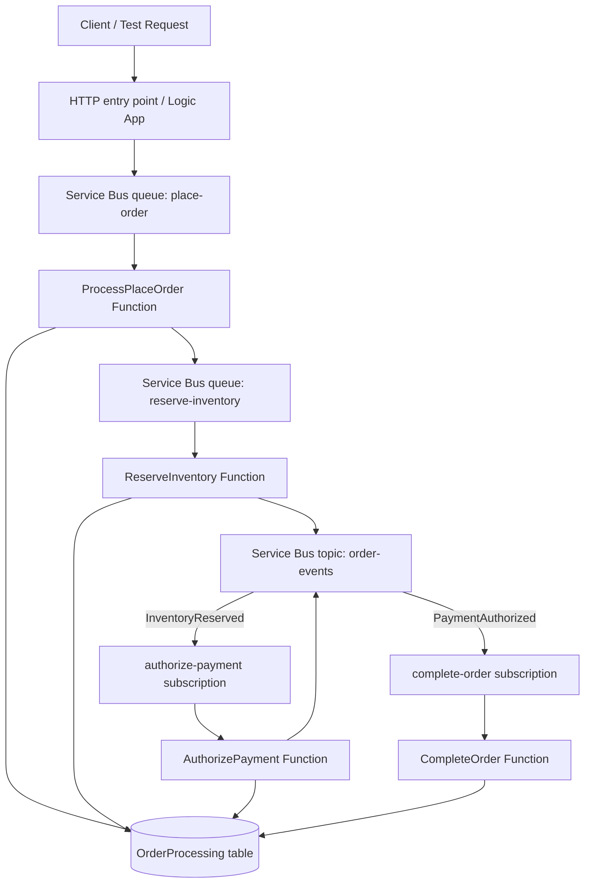
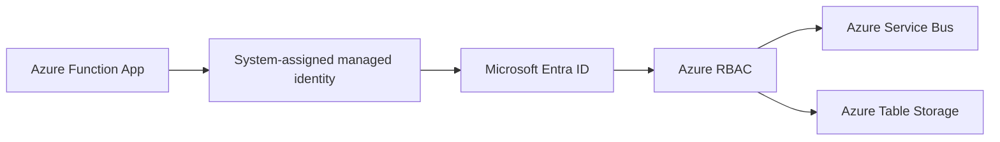
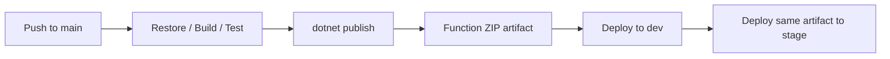

# Contoso.Integration

Contoso.Integration is a .NET 10 isolated-worker Azure Functions solution that demonstrates an event-driven order-processing workflow on Azure.

The application uses Azure Service Bus for durable commands and domain events, Azure Table Storage for order-processing state, managed identities for passwordless access to Azure resources, and GitHub Actions for build, packaging, and promotion across environments.

> This repository contains the application code. The Terraform infrastructure is maintained separately in [`contoso-order-platform`](https://github.com/uvatmvf/contoso-order-platform).

## What this project demonstrates

- Event-driven integration using Service Bus queues, topics, and subscriptions
- Command and event separation
- Idempotent message processing
- Durable order state in Azure Table Storage
- Managed identity and Azure RBAC instead of Service Bus and Storage connection strings
- Build-once, deploy-many artifact promotion through GitHub Actions
- Environment-specific configuration without environment-specific binaries
- Infrastructure ownership separated from application ownership

## Architecture



### Processing flow

1. A request is accepted and a `PlaceOrder` command is placed on the durable `place-order` queue.
2. `ProcessPlaceOrder` validates the command, initializes or loads order state, and publishes a reserve-inventory command.
3. `ReserveInventory` performs the inventory unit of work and publishes an `InventoryReserved` event.
4. `AuthorizePayment` consumes the event, loads the persisted order state, authorizes payment, updates state, and publishes `PaymentAuthorized`.
5. `CompleteOrder` consumes the payment event and marks the order complete.
6. Duplicate deliveries are handled through persisted state and operation identifiers so processing remains idempotent.

## Security model

The deployed Function Apps use system-assigned managed identities.



The Function App identity is granted:

- `Azure Service Bus Data Receiver`
- `Azure Service Bus Data Sender`
- `Storage Table Data Contributor`

Application settings contain resource endpoints rather than secrets:

```text
ServiceBusConnection__fullyQualifiedNamespace
OrderStateStorage__tableEndpoint
```

The same binary runs in dev and stage. Each environment supplies its own managed identity, endpoint settings, and role assignments.

## CI/CD

GitHub Actions builds the application once and promotes the same ZIP package through environments.



Azure authentication uses GitHub OIDC federation through the `GitHub-Contoso-Integration` app registration. No client secret or publish profile is stored in GitHub.

GitHub environments provide deployment-specific variables, including:

```text
AZURE_CLIENT_ID
AZURE_TENANT_ID
AZURE_SUBSCRIPTION_ID
AZURE_FUNCTION_APP_NAME
AZURE_RESOURCE_GROUP
```

## Repository relationship

```text
Contoso.Integration
  Application source, tests, build, package, deployment

contoso-order-platform
  Terraform bootstrap, platform composition, reusable modules,
  managed identities, RBAC, Service Bus, Storage, and Function hosting
```

The two repositories intentionally have separate lifecycles:

- Application changes can be built and deployed without reapplying infrastructure.
- Infrastructure changes can be planned and applied without rebuilding application code.

## Solution structure

```text
Contoso.Integration/
├── .github/
│   └── workflows/
│       └── dotnet.yml
├── ReserveInventory/
│   ├── Functions/
│   ├── Services/
│   ├── Contracts/
│   ├── Program.cs
│   └── Contoso.InventoryFunctions.csproj
├── docs/
│   └── adr/
├── Contoso.Integration.slnx
└── README.md
```

Key functions:

- `ProcessPlaceOrder` — receives the initial order command and starts processing
- `ReserveInventory` — reserves inventory and emits `InventoryReserved`
- `AuthorizePayment` — authorizes payment and emits `PaymentAuthorized`
- `CompleteOrder` — marks the distributed workflow complete

## Prerequisites

- .NET 10 SDK
- Visual Studio 2022/2026 or the `dotnet` CLI
- Azure Functions Core Tools for local execution
- Azure CLI authenticated to the intended development subscription
- Access to the configured development Service Bus namespace and Table Storage account

## Build and test

From the repository root:

```bash
dotnet restore Contoso.Integration.slnx
dotnet build Contoso.Integration.slnx --configuration Release
dotnet test --configuration Release
```

Publish the Function App locally:

```bash
dotnet publish ReserveInventory/Contoso.InventoryFunctions.csproj \
  --configuration Release \
  --output ./publish/function-app
```

The deployment package must contain `host.json`, `functions.metadata`, and `worker.config.json` at the root of the ZIP.

## Local configuration

Use `local.settings.json` for local-only endpoint configuration. Do not commit secrets.

```json
{
  "IsEncrypted": false,
  "Values": {
    "AzureWebJobsStorage": "UseDevelopmentStorage=true",
    "FUNCTIONS_WORKER_RUNTIME": "dotnet-isolated",
    "ServiceBusConnection__fullyQualifiedNamespace": "<dev-namespace>.servicebus.windows.net",
    "OrderStateStorage__tableEndpoint": "https://<dev-storage>.table.core.windows.net"
  }
}
```

`DefaultAzureCredential` uses your local Azure developer identity. That identity must have the same data-plane roles required by the application.

## Test Payment Methods

| Payment Method | Result |
|---------------|--------|
| PAY-APPROVED | Payment succeeds |
| PAY-DECLINED | Business decline |
| PAY-ERROR | Provider exception |
| anything else | Invalid payment method |

## Deployment environments

### Development

- Manually provisioned reference environment
- Used to validate application behavior and managed-identity migration
- Deployment target: `contoso-inventory-functions-dev`

### Stage

- Terraform-managed mirror environment
- Uses reusable Service Bus, Storage, and Function App modules
- Deployment target: `contoso-order-platform-stage-func`

## Architecture decisions

Architecture Decision Records are under [`docs/adr`](docs/adr):

- [ADR-0001: Use separate repositories for application and infrastructure](docs/adr/0001-separate-application-and-infrastructure-repositories.md)
- [ADR-0002: Use managed identity and Azure RBAC](docs/adr/0002-managed-identity-and-rbac.md)
- [ADR-0003: Use queues for commands and topics for domain events](docs/adr/0003-commands-on-queues-events-on-topics.md)
- [ADR-0004: Build once and promote the same artifact](docs/adr/0004-build-once-promote-same-artifact.md)
- [ADR-0005: Provision application infrastructure with Terraform modules](docs/adr/0005-terraform-modules-and-ownership-boundaries.md)

## Current status

Implemented:

- Durable command queues
- Service Bus topic and filtered subscriptions
- Idempotent order processing
- Azure Table state store
- Managed identity for Service Bus and Table Storage
- Terraform-managed stage environment
- GitHub Actions build, artifact packaging, and dev/stage deployment
- OIDC-based Azure login for GitHub Actions

Planned:

- Application Insights and Log Analytics
- End-to-end distributed tracing
- Terraform validation and plan workflows
- Automated integration tests against deployed environments
- Saga compensation and failure-path demonstrations

## Contributing

- Create feature branches from `main`
- Submit pull requests for review
- Keep the build green
- Avoid introducing connection strings or long-lived credentials
- Update ADRs when changing architectural boundaries or deployment strategy

## License

No license is currently included. Add a license before encouraging external reuse or contributions.
